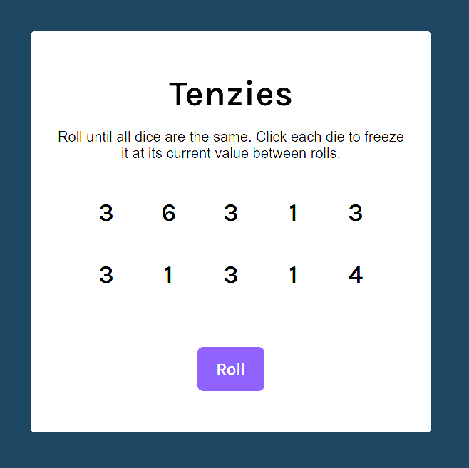
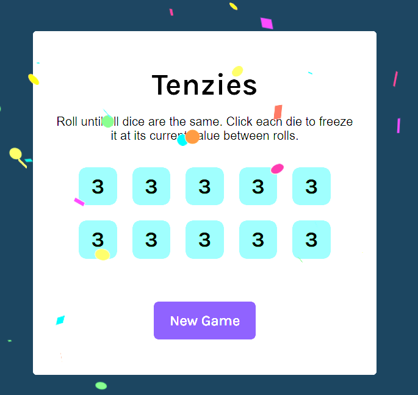

# 🎲 React Tenzies

**React Tenzies** is a simple dice game built with React, inspired by the classic _Tenzies_ game. The goal is to roll the dice until all of them show the same number, strategically holding dice between rolls to achieve the win.

This project focuses on practicing core React concepts such as state management, component-driven UI, and conditional rendering.

---

## ✨ Features

- 🎲 Roll 10 dice with random values (1–6)
- 📌 Click individual dice to **hold** their current value
- 🔄 Re-roll only the dice that are not held
- 🏆 Win detection when all dice are held and match
- 🎉 Confetti animation on winning the game
- 🔁 Start a new game after winning
- 📱 Clean, responsive card-style UI

---

## 🕹️ How the Game Works

1. The game starts with **10 dice**, each showing a random number from 1 to 6.
2. Click on any die to **freeze (hold)** its value.
3. Press **Roll** to re-roll all dice that are not held.
4. Continue rolling and holding dice until:
   - All dice are **held**, and
   - All dice have the **same value**
5. Once the conditions are met, the game is won and a confetti animation is displayed.
6. Click **New Game** to reset and play again.

---

## 🧰 Tech Stack

- **React** – Component-based UI and state management
- **TypeScript** – Type safety and improved developer experience
- **CSS** – Layout and styling
- **nanoid** – Unique ID generation for dice
- **react-confetti** – Win celebration animation

## 📸 ScreenShot

